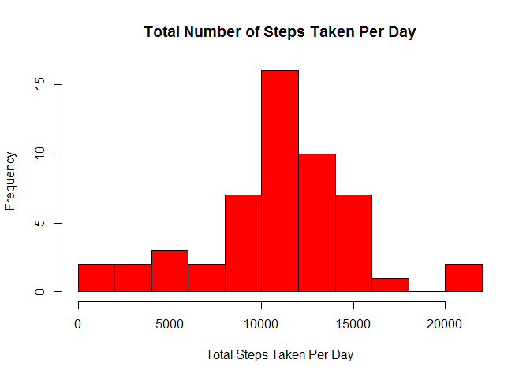
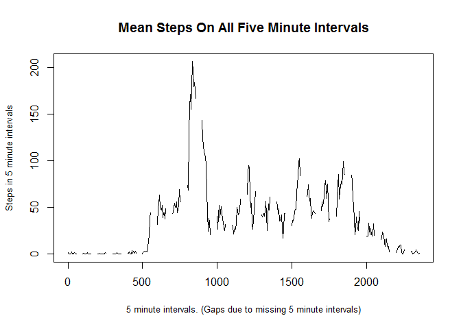
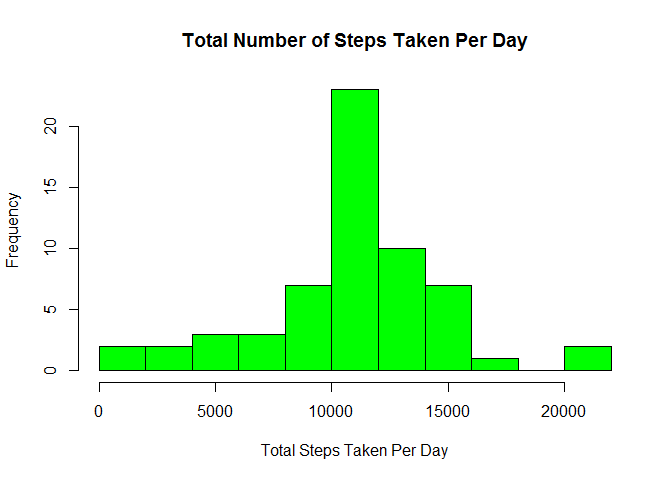
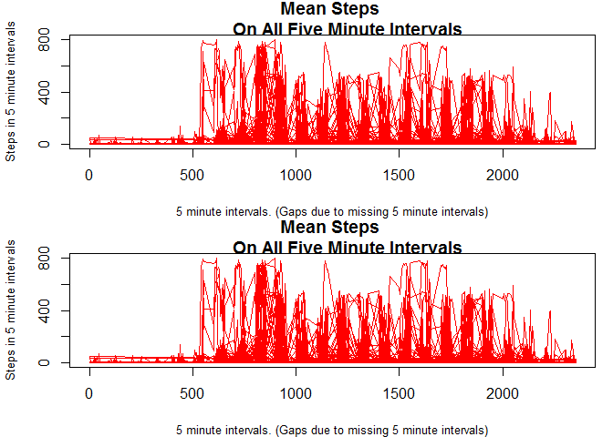

# Reproducible Research: Peer Assessment 1


```r
  ###################################Part 1########################################

  #load and preprocess data
  data <- read.csv("activity/activity.csv",header=TRUE)
  good<-complete.cases(data)
  d_trans <- data[good,]
 
  ###################################Part 2########################################


  #What is mean total number of steps taken per day? 
  sum <- 0 
  sum_vect <- numeric()
  for (i in 1:(length(d_trans[,2])-1)){
    if (d_trans[i,2]==d_trans[i+1,2]){
      sum = sum + d_trans[i,1]
    }
    if (d_trans[i,2]!=d_trans[i+1,2]){
      sum = sum + d_trans[i,1]
      sum_vect <- rbind(sum_vect,sum)
      sum =0
    }
    
  }
  
  hist_data <- sum_vect

  hist(hist_data, col="red",breaks=12, main = "Total Number of Steps Taken Per Day",xlab="Total Steps Taken Per Day" )
```

 

```r
  mmeeaann <- mean(sum_vect)
  mmeedd <- median(sum_vect)
  mes1 <- "Mean total steps:"
  mes2 <- "Median total steps:"
  
  print.noquote(mes1)
```

```
## [1] Mean total steps:
```

```r
  print.noquote(mmeeaann)
```

```
## [1] 10837.71
```

```r
  print.noquote(mes2)
```

```
## [1] Median total steps:
```

```r
  print.noquote(mmeedd)
```

```
## [1] 10890
```

```r
  ###################################Part 3########################################
  #What is the average daily activity pattern?  
  sum <- 0 
  count <- 0
  mean_vect <- numeric()
  
  test_vec <- seq(0,2355,by=5)
  for (j in 1: length(test_vec)){
    for (i in 1: length(d_trans[,3])){
      if (d_trans[i,3]==test_vec[j]){
        sum = sum + d_trans[i,1]
        count = count + 1
       }
     }
     mean_vect <- rbind(mean_vect,sum/count)
     sum = 0
     count = 0
  }

  data_two <- cbind(test_vec,mean_vect)
  good_two<-complete.cases(data_two)
  d_trans_two <- data_two[good_two,]
  
  index <- match(max(d_trans_two[,2]),d_trans_two[,2],-1)
  print.noquote(c("Max Value of: ", max(d_trans_two[,2])))
```

```
## [1] Max Value of:    206.169811320755
```

```r
  print.noquote(c("On interval: ", as.character(d_trans_two[index,1])," to ",as.character(d_trans_two[index+1,1]) ))
```

```
## [1] On interval:  835            to           840
```

```r
  plot(test_vec,mean_vect, type="l", main="Mean Steps On All Five Minute Intervals", ylab="Steps in 5 minute intervals",xlab="5 minute intervals. (Gaps due to missing 5 minute intervals)",pch=".",cex.lab=.8)
```

 

```r
###################################Part 4########################################
 
#Imputing missing values using the mean on the 5-minute interval. If value is missing
#take the mean value for that time interval and use it as a replacement
print.noquote("Number of rows missing data: ")
```

```
## [1] Number of rows missing data:
```

```r
print.noquote(length(data[,1])-length(d_trans[,1]))
```

```
## [1] 2304
```

```r
data_part_three <- cbind(data[,1],data[,2],data[,3])

for (i in 1:length(data_part_three[,1])){
  if(good[i]==FALSE){
    index <- match(data_part_three[i,3],data_two[,1],-1)
    data_part_three[i,1] = mean_vect[index]
  }
}

#once the missing values are filled in, repeat part a
  sum <- 0 
  sum_vect2 <- numeric()
  for (i in 1:(length(data_part_three[,2])-1)){
    if (data_part_three[i,2]==data_part_three[i+1,2]){
      sum = sum + data_part_three[i,1]
    }
    if (data_part_three[i,2]!=data_part_three[i+1,2]){
      sum = sum + data_part_three[i,1]
      sum_vect2 <- rbind(sum_vect2,sum)
      sum =0
    }
    
  }
  
  hist_data2 <- sum_vect2

  hist(hist_data2, col="green",breaks=12, main = "Total Number of Steps Taken Per Day",xlab="Total Steps Taken Per Day" )
```

 

```r
  mmeeaann <- mean(sum_vect2)
  mmeedd <- median(sum_vect2)
  mes1 <- "Mean total steps:"
  mes2 <- "Median total steps:"
  
  print.noquote(mes1)
```

```
## [1] Mean total steps:
```

```r
  print.noquote(mmeeaann)
```

```
## [1] 10766.19
```

```r
  print.noquote(mes2)
```

```
## [1] Median total steps:
```

```r
  print.noquote(mmeedd)
```

```
## [1] 10766.19
```

```r
  print.noquote("Note that the mean and median drop when including the missing data")
```

```
## [1] Note that the mean and median drop when including the missing data
```

```r
  ###################################Part 5########################################
  
  #Note this part is complete. Did not finish in time

  Date1 <- as.Date("2012-10-01")
  Date2 <- as.Date("2012-11-30")    
  weekdays <- (!weekdays(seq(Date1, Date2, "days")) %in% c("Saturday", "Sunday"))

  par(mfrow = c(2,1), mar = c(4,4,2,1))
  
  plot(data_part_three[,3],data_part_three[,1], type="l", col="red", main="Mean Steps 
       On All Five Minute Intervals", ylab="Steps in 5 minute intervals",xlab="5 minute intervals. (Gaps due to missing 5 minute intervals)",pch=".",cex.lab=.8)

  plot(data_part_three[,3],data_part_three[,1], type="l", col="red", main="Mean Steps 
       On All Five Minute Intervals", ylab="Steps in 5 minute intervals",xlab="5 minute intervals. (Gaps due to missing 5 minute intervals)",pch=".",cex.lab=.8)
```

 
